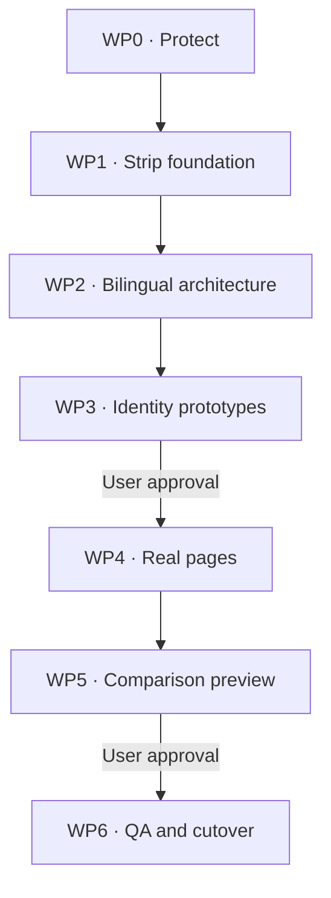

# LTPR Astrowind Rebuild — Locked Work-Package Specification

**Project:** `adirass-web/LTPR` / `cyberdrtabansky.com`
**Status:** Locked for execution
**Version:** 1.4
**Date:** 2026-07-23
**Execution state:** WP0 recovery branch approved and verified; implementation may begin. The remote recovery tag remains a WP6 release-gate requirement.

## 1. Purpose

Rebuild the bilingual LTPR site inside the existing `adirass-web/LTPR` repository, using [Astrowind](https://github.com/arthelokyo/astrowind) as the technical foundation while preserving the existing repository history, approved content, assets, deployment path, and rollback capability.

Astrowind is not the visual design. Its startup/SaaS styling, demo content, imagery, icons, component appearance, and marketing conventions must not survive the foundation-stripping stage.

The rebuild must deliver:

- A restrained, authoritative visual identity.
- Equivalent English LTR and Hebrew RTL experiences.
- Four core page types in both languages.
- Reusable, structured editorial content.
- Static, accessible, low-JavaScript output.
- A reversible migration with a protected production site throughout.

## 2. Decision hierarchy

When instructions conflict, use this order:

1. This locked specification and later written change orders.
2. Approved positioning, content architecture, factual and rights guardrails.
3. Approved English and Hebrew source copy.
4. Existing production behavior that this specification preserves.
5. Astrowind conventions.

Astrowind defaults never override the project brief.

## 3. Superseded decisions

The previous status “typography and colors are deferred” is superseded for the rebuild.

WP3 now owns:

- The final three-token palette.
- Selection of one bilingual typeface family.
- The type scale and script-safe tracking rules.
- The square-corner geometry.
- Photography direction.
- Iconography rules.

The earlier visual implementation is not a source to migrate. Git history preserves it only as an archive.

## 4. Locked global constraints

### 4.1 Repository and deployment

- Rebuild inside `adirass-web/LTPR`; do not create a replacement production repository.
- Preserve the existing Git history.
- Keep `main` deployable until cutover.
- Codex is the sole operator for every Git action: repository setup, fetch, worktree creation, branch changes, commits, tags, pushes, PR creation, merge coordination, deployment checks, and rollback verification.
- The Codex sandbox is the canonical working copy for this rebuild. The user does not maintain, operate, or synchronize a Windows-local working copy for this project.
- All implementation, builds, QA, commits, and release evidence originate in the sandbox. GitHub is the source-of-record boundary and the only synchronization target.
- The user must not be asked to run Git, Node, or package-manager commands, resolve conflicts, authenticate a CLI, copy files, or transport credentials for this rebuild.
- GitHub write access must use the configured Codex environment or approved connected integration. Credentials, personal access tokens, and browser/device-login codes are never requested in chat or stored in the repository.
- No force-pushes.
- No destructive replacement of the repository root or `.git` history.
- The canonical production domain remains `https://cyberdrtabansky.com` without `www`.
- Static output remains the target; no SPA routing.
- Build output is `dist/`.
- The production build command is `npm run build`.

#### 4.1.1 Sandbox Git operating model

- Maintain one clean canonical clone in the Codex sandbox.
- Maintain a read-only `main` checkout or detached worktree for baseline and comparison builds.
- Maintain one writable `rebuild/astrowind` worktree for implementation. No rebuild file is edited in `main`.
- Before every commit, Codex inspects status and stages only task-scoped files; unrelated or pre-existing changes remain untouched.
- Each work package ends in an intentional local commit with a narrow message and recorded SHA. Remote publication follows only after the package’s stated gate passes.
- Branches and tags are pushed by Codex only. `main` advances only through the reviewed PR described in WP6; no direct push to `main` is permitted.
- If sandbox-side GitHub write access or a required repository permission is unavailable, Codex stops before the remote mutation, retains the verified local checkpoint, and reports the precise platform authorization blocker. The user is not redirected to a local terminal as a workaround.

#### 4.1.2 Remote checkpoint, tag, and handoff policy

- **Approved temporary WP0 recovery point:** remote branch `recovery/pre-astrowind-20260723` points to `260abd7a96ab3ba516820e50c0f9f17e04bc2d11`. It was verified from the sandbox on 2026-07-23 and must never be repointed or deleted. It authorizes WP1–WP5 implementation only; it is not represented as a tag and does not satisfy the release-tag gate.
- The configured GitHub integration cannot apply branch-protection rules. Its immutability is therefore enforced by the no-repoint/no-delete policy and by checking the remote ref against the recorded SHA before every risky operation and release gate.
- The required remote annotated tag `pre-astrowind-rebuild-20260723` must point to the same baseline commit and, once created, must never be moved, deleted, or recreated. It is currently unavailable because the Codex connector cannot create tag refs and direct sandbox Git has no GitHub credential. A local tag is not a remote recovery point. The tag remains mandatory before WP6 release readiness, merge, or production cutover.
- The sandbox is the active canonical working copy; GitHub is the durable recovery record. Sandbox storage alone is never treated as a backup.
- Before starting or resuming work, Codex fetches the active branch, records `HEAD` and `origin/<branch>`, and inspects the worktree. If the remote branch advanced unexpectedly, Codex stops to reconcile it without overwriting either history.
- No meaningful work may be left only in the sandbox at a session handoff. Each completed, testable slice is committed on `rebuild/astrowind` and fast-forward published to GitHub before handoff, even when the work package itself has not yet passed its approval gate. Such commits are implementation checkpoints, not release approvals.
- Codex does not use `git stash` as preservation. It does not reset, clean, amend, rebase, or force-update a published rebuild branch. A conflicting or unexpected worktree state is inspected and resolved by a new commit or a new explicitly named branch.
- Before any risky Git operation, Codex creates and verifies a recoverable remote checkpoint. Existing remote branches or tags are never repointed as a substitute for a checkpoint.
- Tags are annotated and immutable. Naming is: `rebuild-wp<N>-complete-YYYYMMDD` after a passed work-package gate, `rebuild-rc-YYYYMMDD.N` for a frozen release candidate, and `production-YYYYMMDD` for the merged, live-verified release. Each tag must be checked both locally and with `git ls-remote --tags` before it is recorded as complete.
- If the configured Codex environment cannot create or verify a required remote tag, Codex records the limitation and stops at the affected release gate. This approved recovery branch is a deliberately bounded WP0 exception, not an equivalent tag.

#### 4.1.3 Branch, PR, CI, deployment, and rollback policy

- `main` is the production branch. It receives no direct pushes and is changed only through a reviewed release PR.
- `rebuild/astrowind` is the sole long-lived integration branch. It is the only writable rebuild worktree. A short-lived `experiment/<slug>` branch may be used only for a clearly bounded alternative and must be published before handoff; it never deploys or merges to `main` directly.
- A draft PR from `rebuild/astrowind` to `main` is opened when the first implementation package is ready for shared review. It remains draft until WP6 has passed. A changed `main` is incorporated by a normal merge into `rebuild/astrowind`, followed by the full required checks; published rebuild history is not rebased.
- Every published checkpoint records its parent SHA, changed paths, checks run, results, and remote SHA. CI failures block the relevant gate; they are diagnosed and corrected in a new commit rather than bypassed.
- The release PR records the recovery-branch SHA, baseline-tag SHA, candidate SHA, target `main` SHA, required checks, deployment target, and rollback target. Codex requests explicit user release approval before marking it ready or merging.
- The release uses a merge commit so that one deliberate revert can restore the pre-release tree. If repository settings make that impossible, Codex stops and requests an explicit approved alternative before merging.
- Production deploys only from the merged `main` SHA. Manual deployment dispatches may not target a candidate branch. Codex records the workflow run, deployed SHA, production URL, and post-deploy verification result.
- A production defect triggers a `rollback/<timestamp>` branch and a revert PR against `main`; no history is rewritten and no tag is moved. The rollback is verified in CI and in production, then recorded with its resulting deployment SHA.

### 4.2 Route contract

The core routes are:

- `/en/`
- `/en/about/`
- `/en/media/`
- `/en/writing/`
- `/he/`
- `/he/about/`
- `/he/media/`
- `/he/writing/`

The root `/` may perform a static default-language redirect or present a minimal locale choice. It must not become a ninth content page.

Navigation is limited to:

- Home
- Media
- About
- Writing
- EN / עברית route-aware language switch

Contact remains a footer-level “Private inquiries” action, not a navigation page.

### 4.3 Language and direction

- English uses `lang="en"` and `dir="ltr"`.
- Hebrew uses `lang="he"` and `dir="rtl"`.
- EN and HE must use the same page hierarchy, component roles, information density, and responsive behavior.
- Visual parity does not mean mechanically mirroring imagery or forcing identical letter-spacing on two different scripts.
- Use logical CSS properties; physical `left` and `right` declarations require a documented exception.
- Mixed-direction institutional names and URLs must use appropriate bidi isolation such as `<bdi>`.
- The language switch must preserve the paired page whenever a translation exists.

### 4.4 Content and claims

- Approved copy is migrated without silent rewriting.
- Factual, legal, rights, Singapore wording, and *The National Interest* guardrails remain binding.
- The identity remains centered on defense innovation, AI, digital trust or national resilience, and cybersecurity capacity building.
- The site remains restrained, first-person, and media-forward; it must not read like a sales funnel or an academic CV dump.
- No invented publications, clients, engagements, quotations, links, contact details, or credentials.
- Strategy documents and private internal notes must not be committed to the public repository.

### 4.5 Asset rules

- Reuse the existing 2:3 Home portrait derivatives byte-for-byte.
- Reuse the existing 1:1 About portrait derivatives byte-for-byte.
- Preserve AVIF, WebP, and JPEG source sets and explicit image dimensions.
- Do not recrop, retouch, recolor, upscale, or re-encode approved portraits unless separately authorized.
- The intended primary institutional proof strip contains World Bank, Singapore CSA, IISS, and IAI only.
- Use official standalone SVG or transparent PNG marks. Prefer an official single-color variant. If no approved monochrome variant exists, use the official full-color mark rather than unofficially recoloring it.
- Sierra Leone and Georgia assets are supporting engagement evidence, not primary-strip marks.
- The RAI video file must not be committed. A separately hosted, rights-cleared, subtitled cut may be embedded later.
- Press assets and excerpts require legal fair-use and source-link discipline.

## 5. Model-tier policy

Model assignment is based on consequence and judgment, not task size.

| Tier | Execution model | Reasoning level | Use |
|---|---|---:|---|
| Tier A — Critical | `gpt-5.6-sol` | xhigh | Architecture, bilingual behavior, identity decisions, final release judgment |
| Tier B — Production | `gpt-5.6-sol` | high | Complex implementation, component systems, page construction, migration |
| Tier C — Bounded | `gpt-5.6-terra` | high | Codex-managed procedural Git, CI, inventory, preview assembly, mechanical verification |

Model tier does not authorize autonomous scope expansion. Each WP remains bound by its gate.

## 6. Work-package summary

| WP | Name | Model tier | Starts after | Completion gate |
|---|---|---|---|---|
| WP0 | Protect production and establish migration baseline | Tier C | Specification approval | Recoverable tag, branch, manifests, verified baseline |
| WP1 | Strip Astrowind to a clean foundation | Tier B | WP0 | Clean static build with no demo material |
| WP2 | Build the bilingual EN/HE architecture | Tier A | WP1 | Neutral shell passes route, locale, bidi, SEO, and parity checks |
| WP3 | Fully revise and approve the visual identity | Tier A | WP2 | One Home direction approved in EN, HE, desktop, and mobile |
| WP4 | Rebuild and populate the real pages | Tier B | WP3 | Four complete EN pages and production-ready paired HE structures |
| WP5 | Publish a reversible comparison preview | Tier C | WP4 candidate build | Current and candidate sites viewable without merging |
| WP6 | QA, release, cutover, and rollback verification | Tier A | WP5 approval | Release checks pass, PR merged, live SHA verified |

---

## WP0 — Protect production and establish the migration baseline

**Model tier:** Tier C — `gpt-5.6-terra`, high reasoning

### Objective

Create a provable recovery point and a controlled rebuild branch without changing the live site.

### Tasks

#### WP0.1 — Resolve and record the live baseline

**In scope**

- Fetch the remote repository.
- Establish the clean sandbox clone and the sanctioned `main` baseline checkout before examining or changing source.
- Resolve the actual remote `main` HEAD at execution time.
- Record the commit SHA, deployment URL, workflow state, Node/npm versions, and successful build result.

**Out of scope**

- Assuming an earlier SHA is still current.
- Editing source files.
- Using, requesting, or relying on a user-operated local checkout.

**Deliverable**

- `docs/rebuild/BASELINE.md`

#### WP0.2 — Create the recovery tag and rebuild branch

**In scope**

- Create and verify `recovery/pre-astrowind-20260723` at the resolved `main` HEAD. This temporary remote recovery branch is approved for WP0–WP5 only and must not be repointed or deleted.
- Create and verify annotated tag `pre-astrowind-rebuild-20260723` at the same commit when Codex receives tag-ref authority. It is mandatory before WP6 release readiness, merge, or production cutover.
- Create `rebuild/astrowind` from that exact commit.
- Create the writable sandbox worktree for `rebuild/astrowind`; all subsequent package work occurs there.

**Out of scope**

- Merging to `main`.
- Deleting old branches or tags.

**Deliverable**

- Verified remote recovery branch and remote rebuild branch; remote tag status recorded.
- Recorded sandbox worktree paths and baseline/rebuild SHAs in `docs/rebuild/BASELINE.md`.

#### WP0.3 — Pin the template source

**In scope**

- Pin Astrowind to commit `522530a242f5855f22a44a001f7b2e199669073d`.
- Record the upstream URL, commit, license, and files selected for import.
- Preserve required MIT attribution.

**Out of scope**

- Tracking Astrowind `main`.
- Automatic upstream updates.

**Deliverable**

- `docs/rebuild/UPSTREAM_TEMPLATE.md`

#### WP0.4 — Inventory reusable material

**In scope**

- Inventory approved copy, Hebrew copy status, portraits, logo candidates, video references, press data, metadata, workflows, domain settings, and deployment files.
- Generate SHA-256 checksums for binary assets.
- Classify each item as `reuse unchanged`, `migrate structurally`, `replace`, `pending`, or `exclude`.

**Out of scope**

- Editing, optimizing, or sourcing assets.

**Deliverables**

- `docs/rebuild/ASSET_MANIFEST.md`
- Machine-readable checksum file.

### WP0 gate

WP0 passes for implementation only when:

- Current production can be restored from the approved immutable remote recovery branch.
- The rebuild branch exists remotely.
- The Codex sandbox contains an isolated writable rebuild worktree and a separately reproducible baseline checkout.
- The current production build passes.
- The baseline SHA and asset checksums are recorded.
- `main` has not been modified by WP0.

The remote annotated baseline tag remains a WP6 release gate. No merge or production cutover may proceed without it.

---

## WP1 — Strip Astrowind to a clean foundation

**Model tier:** Tier B — `gpt-5.6-sol`, high reasoning

### Objective

Adopt Astrowind’s maintainable Astro foundation without importing its product-marketing identity.

### Tasks

#### WP1.1 — Import the pinned foundation

**In scope**

- Import source from the pinned Astrowind commit into the rebuild branch while preserving LTPR Git history.
- Adopt Astro 6, Tailwind CSS 4, TypeScript, static output, the lockfile, linting, formatting, sitemap support, Content Collections/MDX, and local image handling where they remain useful after stripping.

**Out of scope**

- Replacing the repository history.
- Using an unpinned template version.
- Visual customization.

#### WP1.2 — Remove demo and SaaS material

**Remove**

- Demo routes and demo copy.
- Pricing, testimonials, statistics, FAQ, feature grids, SaaS CTAs, product screenshots, and startup hero patterns.
- Unsplash and other demo imagery.
- Decorative gradients, generic icons, icon grids, and decorative animation.
- Dark-mode toggle and default dark theme.
- Dropdown-heavy navigation.
- Generic blog landing behavior, automatic categories, automatic tags, and “latest posts” framing.
- Analytics and external-image services until separately required.

**Retain only if technically justified**

- Small accessible primitives.
- Build utilities.
- Metadata helpers.
- Content schema patterns.
- Image utilities.

#### WP1.3 — Normalize the toolchain

**In scope**

- Set Node to version 22.12 or later within the Node 22 line.
- Commit and verify a valid lockfile.
- Use `npm ci` in CI.
- Update GitHub verification workflows to Node 22.
- Keep build output at `dist/`.

**Out of scope**

- `npm install` in CI as a permanent substitute for a lockfile.
- Unreviewed dependencies.

#### WP1.4 — Establish the neutral shell

**In scope**

- Create only the minimum layout, metadata, header, main, footer, and content primitives required for WP2.
- Use deliberately neutral temporary styling.

**Out of scope**

- Any design proposal.
- Final colors, typography, photography, icons, or page composition.

### Deliverables

- Clean Astrowind-derived codebase on the rebuild branch.
- Dependency and removed-feature register.
- Updated verification workflow.

### WP1 gate

WP1 passes only when:

- `npm ci`, type checks, linting, formatting checks, and `npm run build` pass.
- No Astrowind demo route, brand, image, copy, gradient, icon grid, pricing block, testimonial, or startup CTA remains visible.
- The repository contains no unapproved external tracking.
- The neutral shell is static and usable without client-side routing.

---

## WP2 — Build the bilingual EN/HE architecture

**Model tier:** Tier A — `gpt-5.6-sol`, xhigh reasoning

### Objective

Create one locale-aware component and content architecture that produces equivalent English LTR and Hebrew RTL sites.

### Tasks

#### WP2.1 — Implement the route contract

**In scope**

- Implement the eight locked routes.
- Implement a static root-language decision.
- Add route-paired language switching.
- Keep navigation data-driven and shared.

**Out of scope**

- New routes.
- A separate Contact route.
- SPA routing.

#### WP2.2 — Separate locale content from components

**In scope**

- Store English and Hebrew content separately from layouts.
- Define schemas for pages, essays, media items, publication status, locale, translation key, source URL, original publication date, rights status, and asset references.
- Prevent layout components from embedding English strings.

**Out of scope**

- Translating pending Hebrew copy.
- Rewriting approved English copy.

#### WP2.3 — Implement direction-safe primitives

**In scope**

- Set locale-specific `lang` and `dir`.
- Use logical spacing, sizing, border, and positioning properties.
- Isolate mixed-direction text.
- Keep portraits unmirrored.
- Mirror only directional interface symbols that require mirroring.
- Use one shared DOM/component hierarchy across locales.

**Out of scope**

- Duplicate EN-only and HE-only component trees.
- CSS transforms that mirror whole sections.

#### WP2.4 — Implement locale metadata

**In scope**

- Canonical URLs.
- Reciprocal `hreflang` links for `en`, `he`, and `x-default` where appropriate.
- Locale-specific Open Graph metadata.
- Locale-complete sitemap.
- Correct language and direction in structured data.

#### WP2.5 — Create a parity ledger

**In scope**

- Track, for every route and section, EN content status, HE content status, translation-review status, assets, metadata, and publication readiness.

**Deliverable**

- `docs/rebuild/LOCALE_PARITY.md`

### WP2 gate

WP2 passes only when:

- All eight routes build.
- Each route has correct `lang`, `dir`, canonical, `hreflang`, and paired language switch.
- EN and HE neutral shells contain the same semantic section structure.
- No component contains hard-coded locale copy.
- Automated checks find no unexplained physical-direction CSS.
- Keyboard order remains logical in both directions.

---

## WP3 — Fully revise and approve the visual identity

**Model tier:** Tier A — `gpt-5.6-sol`, xhigh reasoning

### Objective

Replace both the current site styling and Astrowind’s styling with a restrained, architectural, bilingual identity built from a tightly controlled system.

### Reference boundary

- Astrowind supplies code architecture only.
- Pojo Frame/Firma may inform main-site composition and restraint.
- Zapa may inform Writing and Media information architecture.
- None of these references may supply the final palette, typography, rounded geometry, icons, imagery, decorative effects, or demo components.

### Locked identity position

- Strategic editorial modernism.
- Light-first.
- Authoritative through proportion, typography, portraiture, negative space, and documentary evidence.
- No generic cyber aesthetic.
- No SaaS aesthetic.
- No magazine-template imitation.
- No ornamental motion.
- No sales-funnel tone.

### Tasks

#### WP3.1 — Lock the color system

Use exactly three production color tokens:

| Token | Value | Role |
|---|---|---|
| `--color-canvas` | `#f6f6f6` | Site canvas and light text on the accent |
| `--color-ink` | `#000000` | Text, rules, outlines, and structural anchor |
| `--color-accent` | `#02291f` | Midnight Forest; primary CTA only |

Rules:

- `#ebebeb` is not an additional token. It may replace `#f6f6f6` at the WP3 approval gate only if the prototype shows that the darker canvas is superior.
- No gradients.
- No additional brand colors.
- No decorative tints.
- No arbitrary gray scale.
- Logos and photography may retain colors inherent in approved source assets.
- Accent is used for the primary CTA.
- At most one accent-filled CTA may be visible in a viewport at one time.
- Secondary actions use ink text, underline, or a square ink outline.
- Focus visibility must not depend on color alone.

#### WP3.2 — Select and lock one bilingual typeface

Requirements:

- One primary typeface family must cover both Hebrew and Latin.
- No secondary display family.
- One production weight across headings, body, navigation, captions, buttons, and metadata.
- Hierarchy comes from size, line height, case where linguistically valid, spacing, and layout—not weight variation.
- English and Hebrew use the same hierarchy and scale roles.
- Letter-spacing must be script-safe; English tracking values must not be copied mechanically to Hebrew.
- The font must be legally self-hostable or have an approved production delivery method.
- The selected family must include all punctuation, numerals, and bidi behavior needed by the site.

Selection task:

- Test no more than two qualifying bilingual families in the real Home prototype.
- Select one at the WP3 approval gate.
- Record license, files, subsets, weights, loading strategy, fallbacks, and measured layout impact.

Until the family is approved, WP3 is not complete.

#### WP3.3 — Lock geometry

Rules:

- `border-radius: 0` on every surface and control.
- No pills.
- No rounded cards.
- No circular icon buttons unless the circle is intrinsic to an approved institutional logo.
- Image masks remain rectangular.
- Buttons, menus, inputs, media frames, cards, tags, and overlays use square corners.
- Use hairline rules and proportion rather than decorative shadows.

#### WP3.4 — Lock iconography

Rules:

- Use icons only when text alone is insufficient.
- Icons are geometric, unfilled, and drawn at a 1px visual stroke.
- Keep one coherent grid and optical size.
- Do not use security-industry shorthand: shields, locks, keys, fingerprints, circuit brains, glowing networks, targets, radar, hooded figures, or code-rain motifs.
- Do not use generic feature icons from Astrowind.
- Directional icons mirror only where meaning requires it.
- Every non-decorative icon has an accessible name or accompanying visible label.

#### WP3.5 — Define photography usage

Existing approved portraits:

- Reuse the existing 2:3 portrait on Home.
- Reuse the existing 1:1 portrait on About.
- Do not mirror portraits between LTR and RTL.

**TO DO — Author input**

> The author will provide a small set of singular images that suggest protection through environment and mood.

Until supplied:

- Do not source stock photography.
- Do not generate substitute images.
- Do not fill slots with decorative placeholders.
- The design must remain complete using portraits, type, rules, and approved institutional evidence alone.

When supplied, each image requires a rights record, intended page/section, crop-safe area, alt-text decision, responsive derivative plan, and checksum.

#### WP3.6 — Produce two real Home directions

Each direction must use:

- Approved Home copy.
- Real 2:3 portrait.
- A provisional proof strip using only approved institutional marks.
- The fixed three pillars: defense innovation, AI, and capacity building.
- Media feature.
- Writing preview.
- Private-inquiries close.

Each direction must be shown as:

- English desktop.
- Hebrew desktop.
- English mobile.
- Hebrew mobile.

Both directions must obey the same locked color, typography, geometry, photography, iconography, content, and accessibility rules. Variation is limited to composition, scale, sequence, density, rules, and use of space.

#### WP3.7 — Record the selected system

**Deliverables**

- `docs/design/VISUAL_IDENTITY.md`
- `docs/design/TOKENS.md`
- `docs/design/TYPEFACE.md`
- Approved Home reference screenshots in EN/HE desktop/mobile.
- Component-state sheet for navigation, links, CTA, focus, media, proof strip, and footer.

### WP3 gate

WP3 passes only when:

- One of the two Home directions is explicitly approved.
- The exact canvas choice is approved.
- One bilingual typeface family and one weight are approved.
- The direction works in both scripts and both target viewport classes.
- No additional color token, radius, weight hierarchy, stock image, generic security motif, or Astrowind visual convention appears.
- No other page is visually implemented before this gate.

---

## WP4 — Rebuild and populate the real pages

**Model tier:** Tier B — `gpt-5.6-sol`, high reasoning

### Objective

Apply the approved WP3 system to the real page architecture and approved content.

### Tasks

#### WP4.1 — Build the shared site frame

**In scope**

- Header, minimal navigation, route-paired language switch, main landmark, footer, private-inquiries action, skip link, focus states, and responsive behavior.

**Out of scope**

- Additional navigation.
- Sticky promotional CTA.
- Newsletter, lead magnet, or sales modal.

#### WP4.2 — Build Home

Sections:

- Identity-led portrait hero.
- Institutional proof strip.
- Three-pillar presentation.
- Selected media feature.
- Selected writing preview.
- Private-inquiries close.

The page must communicate authority through evidence and composition, not inflated claims.

#### WP4.3 — Build About

**In scope**

- 1:1 portrait.
- Operational narrative.
- Selected credentials.
- Practical value of first-principles and defense-innovation expertise.

**Out of scope**

- Full CV dump.
- Unselected chronology.
- Decorative credential badges.

#### WP4.4 — Build Media

**In scope**

- Lead appearance.
- Curated video, television, press, and speaking records.
- Original dates, source identity, rights status, and direct source URLs where approved.
- Zapa-informed scanability without adopting its visual identity.

**Out of scope**

- Scraped press text.
- Unverified deep links.
- Autoplay.
- Committing the RAI video.

#### WP4.5 — Build Writing

**In scope**

- Curated editorial index.
- Publication, original date, topic, abstract/deck, source URL, and translation status.
- MDX essay route support through Content Collections.

**Out of scope**

- Generic chronological blog feed.
- Categories, tags, pagination, or “latest posts” language unless separately approved.

#### WP4.6 — Migrate English content

**In scope**

- Populate all four English pages using the approved source.
- Preserve embedded URLs and approved wording.
- Record every required unresolved field.

**Out of scope**

- Editorial rewriting.
- Filling gaps by inference.

#### WP4.7 — Build Hebrew parity

**In scope**

- Apply identical page roles and components to Hebrew.
- Populate only approved or native-reviewed Hebrew copy.
- Keep incomplete translation status explicit in internal preview and parity documentation.

**Out of scope**

- Machine-translated production copy.
- Publishing an incomplete Hebrew page as complete.

#### WP4.8 — Integrate approved assets

**In scope**

- Reuse portrait derivatives without byte changes.
- Integrate official World Bank, CSA, IISS, and IAI marks when production-grade files and rights status are available.
- Use normal asset files, not base64-embedded production images.

**Out of scope**

- CSS-filtered pseudo-monochrome logos.
- Recoloring unofficial logo assets.
- Adding Sierra Leone or Georgia to the primary proof strip.

### Deliverables

- Four complete English pages.
- Four structurally equivalent Hebrew pages.
- Locale content collections.
- Page-specific metadata and structured data.
- Updated parity and asset manifests.

### WP4 gate

WP4 passes only when:

- All eight routes build from shared components and locale content.
- All English content slots are complete or explicitly blocked in the register.
- Hebrew structure matches English and publication status is honest.
- Portrait checksums match WP0.
- No unapproved copy, logo treatment, stock image, icon, or visual token appears.
- Responsive keyboard and screen-reader structure works on every page type.

---

## WP5 — Publish a reversible comparison preview

**Model tier:** Tier C — `gpt-5.6-terra`, high reasoning

### Objective

Allow direct review of the existing production implementation and the rebuild without merging unfinished work into `main`.

### Tasks

#### WP5.1 — Build both versions independently

**In scope**

- Build the protected current `main` from the Codex-managed baseline worktree or detached checkout.
- Build `rebuild/astrowind` from the separately managed writable sandbox worktree.
- Give the candidate the correct nested Pages base path.

**Out of scope**

- Copying generated files between source trees.
- Modifying `main` to support the preview.

#### WP5.2 — Assemble one Pages artifact

Publish:

- Current site at the existing `/LTPR/` preview path.
- Candidate at `/LTPR/next/`.
- Candidate English at `/LTPR/next/en/`.
- Candidate Hebrew at `/LTPR/next/he/`.

Production-domain DNS and canonical settings remain unchanged.

#### WP5.3 — Produce review evidence

**Deliverables**

- Direct review URLs.
- Desktop and mobile screenshots for EN and HE.
- Build SHA displayed in preview metadata or a non-visual build manifest.
- Known-issues register.

### WP5 gate

WP5 passes only when:

- Both builds are independently reproducible.
- The current preview remains intact.
- Candidate assets, links, canonicals, and language switching respect the nested base path.
- No candidate source has been merged into `main`.

---

## WP6 — QA, release, cutover, and rollback verification

**Model tier:** Tier A — `gpt-5.6-sol`, xhigh reasoning

### Objective

Prove that the rebuild is complete, safe, bilingual, accessible, performant, and recoverable before replacing the current deployment.

### Tasks

#### WP6.1 — Build and code quality

Required:

- `npm ci`
- Type checks
- Lint
- Formatting check
- `npm run build`
- Internal-link check
- Missing-asset check
- Placeholder scan
- Unused demo/dependency scan

No check may be bypassed to obtain a green release.

#### WP6.2 — Content and rights QA

Required:

- Approved-copy diff.
- Embedded-URL preservation check.
- EN/HE route and section parity report.
- Translation-review status.
- Institutional-name and client-proof verification.
- Logo source and rights register.
- Press excerpt and source-link audit.
- Zero invented claims or fields.

#### WP6.3 — Visual and bidi QA

Required:

- EN desktop and mobile.
- HE desktop and mobile.
- Navigation open/closed states.
- Long headings and metadata.
- Mixed Hebrew/English names, dates, URLs, and numerals.
- Portrait focal area.
- Proof strip at all breakpoints.
- Writing and Media density.
- Print behavior where applicable.

Automated visual comparison supports review but does not replace human inspection.

#### WP6.4 — Accessibility QA

Required:

- Keyboard-only completion of all navigation and controls.
- Visible focus.
- Skip link.
- Correct landmarks and heading order.
- Alternative-text decisions.
- Accessible names for non-decorative icons.
- Reduced-motion behavior.
- Forced-colors/high-contrast behavior.
- Color contrast.
- No direction-dependent reading-order defects.

Target Lighthouse Accessibility score: at least 95 on each core page type, with every remaining issue documented and manually reviewed.

#### WP6.5 — Performance QA

Targets on a production-like mobile run:

- Lighthouse Performance: at least 90.
- Largest Contentful Paint: no more than 2.5 seconds.
- Cumulative Layout Shift: no more than 0.1.
- No unnecessary client-side hydration.
- Responsive image source selection verified.
- Font loading produces no unacceptable layout shift.

Scores are evidence, not substitutes for inspecting the built files and waterfall.

#### WP6.6 — SEO and metadata QA

Required:

- Canonical domain.
- Route-specific titles and descriptions.
- Reciprocal `hreflang`.
- Open Graph locale and imagery.
- Sitemap.
- Robots behavior.
- Structured data.
- No preview-base URL leaking into production metadata.

#### WP6.7 — Release by PR

**In scope**

- Freeze candidate SHA.
- Record the candidate SHA and the target `main` SHA before opening the PR.
- Open a focused PR from `rebuild/astrowind` to `main`.
- Review the complete diff against the baseline and locked spec.
- Merge without force.
- Deploy only the merged `main` SHA.
- Verify workflows and live production.

**Out of scope**

- Direct unreviewed replacement of `main`.
- Deleting the recovery tag or old history.

#### WP6.8 — Verify rollback

**In scope**

- Document the exact revert procedure.
- Confirm that the pre-rebuild tag still resolves.
- Confirm that deployment can be restored from the tag without reconstructing assets manually.

### Deliverables

- `docs/rebuild/RELEASE_QA.md`
- `docs/rebuild/CONTENT_PARITY_FINAL.md`
- `docs/rebuild/ASSET_AND_RIGHTS_FINAL.md`
- `docs/rebuild/ROLLBACK.md`
- Merged PR and verified production SHA.
- Git audit record containing the recovery-tag SHA, branch SHA, PR URL, merge SHA, deployment SHA, and rollback target.

### WP6 gate

WP6 passes only when:

- Every required check passes or has an explicit user-approved exception.
- The selected WP3 identity is implemented without drift.
- EN and HE production routes are complete and direction-correct.
- The live site serves the merged SHA.
- The recovery tag remains intact and the rollback procedure is verified.

---

## 7. Dependency order and stop conditions

Stop and request a decision when:

- The remote `main` SHA differs from the expected baseline.
- The pinned Astrowind version cannot build with the locked toolchain.
- A requested dependency expands the static site into an SPA.
- A bilingual typeface cannot meet licensing or Hebrew-quality requirements.
- A design direction requires an extra palette token, weight, radius, or stock image.
- Approved copy and repository copy differ materially.
- A logo lacks an approved asset or rights status.
- Hebrew copy is not native-reviewed at the production gate.
- A release check requires bypassing protection or rewriting Git history.
- Codex sandbox GitHub write access or required repository permission is unavailable. This is a platform-authorization blocker; do not transfer Git work to the user’s local machine.

## 8. Explicit TODO register

These items do not block WP0–WP3 unless noted, but they block affected production sections:

- **Typeface:** WP3 must select and approve one bilingual family and one weight.
- **Environmental photography:** The author will provide a small set of singular images that suggest protection through environment and mood.
- **Institutional marks:** Obtain production-grade official assets for World Bank, Singapore CSA, IISS, and IAI.
- **Media:** Prepare, subtitle, rights-clear, host, and embed the RAI clip without committing the video file.
- **Press:** Verify deep links, dates, outlet naming, and usage rights.
- **Contact:** Supply the production private-inquiries email or approved contact action.
- **Hebrew:** Complete native review of About, Media, and Writing copy before production release.
- **Domain cutover:** Verify production DNS and canonical-domain behavior during WP6.

## 9. Definition of done

The rebuild is done only when:

- The old site remains recoverable from a remote tag.
- Every Git mutation was performed and recorded by Codex from the sandbox, with `main` advanced only through the reviewed PR.
- Astrowind demo identity and content are absent.
- The site uses the locked three-token palette.
- Every surface has 0px radius.
- One approved bilingual typeface and one weight serve both scripts.
- No generic security imagery or iconography appears.
- The approved portraits remain byte-identical.
- EN and HE share the same information architecture and production quality.
- Four English and four Hebrew routes are complete or intentionally withheld from production rather than misrepresented.
- Current and candidate versions were reviewed side by side.
- Code, content, rights, accessibility, bidi, performance, SEO, and deployment QA pass.
- The rebuild reaches production through a reviewed PR and the live SHA is verified.

## 10. Change control

This document is the execution baseline.

A change requires an explicit written decision if it affects:

- Route structure.
- Repository or deployment strategy.
- Astrowind pin.
- Color tokens.
- Typeface-family count or weight count.
- Border radius.
- Photography source.
- Iconography style.
- EN/HE parity.
- Primary institutional proof-strip membership.
- Approved copy or factual claims.
- Work-package gate or model tier.
- Codex-managed sandbox Git workflow, branch policy, or release authority.

Mechanical implementation details may change without a formal change order only when they do not alter the locked behavior, identity, content, or acceptance criteria.
